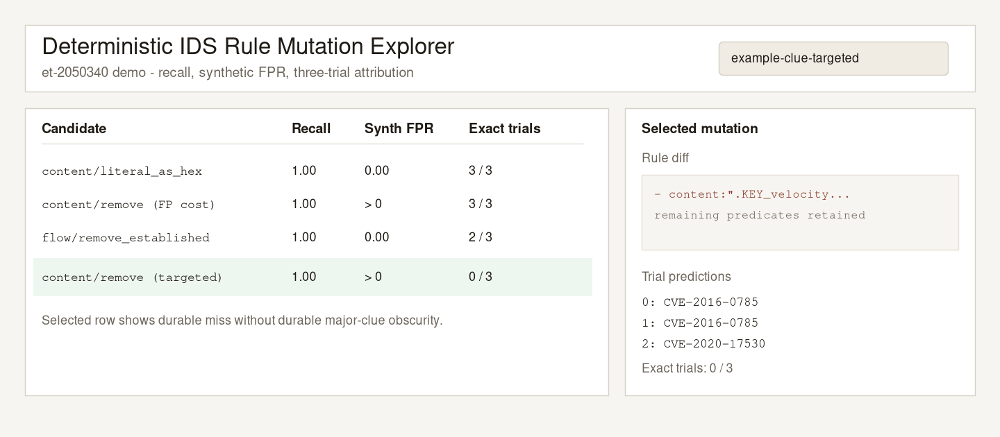

# Reducing Vulnerability Information Leakage from Public IDS Rules

Deterministic Suricata rule mutation and multi-trial LLM attribution evaluation.



## Why this project exists

Public IDS rules often contain distinctive literals, paths, and protocol cues that
make the underlying CVE easy for an LLM to identify. This framework asks whether
small, recall-preserving rule mutations can reduce that leakage without
destroying detection quality.

## Key results

From the final clue-targeted single-mutation experiment:

- **757** deterministic single mutations across **19** ET Open rules
- **754 / 757** preserved positive recall
- Attacker exact in **1,164 / 1,251** primary completed trials (**93.1%**)
- Only **8 / 417** complete primary candidates were never exact
- **0 / 417** achieved durable major-clue obscurity
- **275 / 754** recall-preserving mutations introduced synthetic false positives
- One-shot testing inflated apparent misses by **3.62×**

Primary attacker analysis uses the **11** baseline-qualified rules whose CVE was
identified in all three baseline trials. Six primary recall-preserving candidates
lacked complete three-trial evidence and were excluded from durable-obscurity
counts.

## How the framework works

1. Parse a Suricata rule into predicates and dependencies.
2. Generate deterministic mutations (semantic, representation, performance).
3. Replay synthetic positive / negative PCAPs through Suricata.
4. Optionally score benign false positives.
5. Run three independent attacker trials with ranked-clue responses.
6. Attribute predictions with a reviewed related-CVE registry and clue scores.
7. Inspect outcomes in the Mutation Explorer.

See [docs/architecture.md](docs/architecture.md) and
[docs/methodology.md](docs/methodology.md).

## Quick start

```bash
python3.12 -m venv .venv
source .venv/bin/activate
pip install -e ".[dev,dashboard]"
pytest -q -m "not integration"
```

No API key is required for deterministic generation, traffic tests, reports, or
the included explorer demo.

## Reproduce deterministic mutation generation

```bash
hardening-mutations-clue-targets --help
hardening-mutations-clue-manifest --help
hardening-mutations \
  --experiment-manifest experiments/single-clue-targeted-v1/manifest.json \
  --dataset-fixtures \
  --attacker-model gpt-5.5 \
  --run-id dataset-clue-targeted-singles-v1 \
  --preflight
```

## Run optional LLM attacker trials

```bash
export LITELLM_API_KEY=...
export LITELLM_BASE_URL=https://your-compatible-endpoint/v1
hardening-mutations \
  --experiment-manifest experiments/single-clue-targeted-v1/manifest.json \
  --dataset-fixtures \
  --attacker-model <model> \
  --run-id my-run \
  --resume
```

## Explore results

```bash
python -m hardening_game.mutations.demo_data
hardening-dashboard
```

Open the UI and select `example-clue-targeted`.

## Repository map

| Path | Purpose |
| --- | --- |
| `hardening_game/mutations/` | Mutation engine, evaluator, explorer |
| `fixtures/dataset/` | 19-rule fixtures and suites |
| `pcap/dataset/` | Synthetic validation PCAPs |
| `experiments/single-clue-targeted-v1/` | Locked final experiment manifest |
| `examples/results/` | Sanitized explorer demo |
| `ui/` | Mutation Explorer frontend |
| `docs/` | Architecture, methodology, reproducibility |

## Methodological limitations

- One attacker model / prompt / schema version
- Primary inference rests on 11 independent rules
- Related-CVE registry coverage is incomplete for some wrong predictions
- Precision is suite-relative, not production traffic
- ET Open rules are third-party content; see third-party notices

## Licensing

- Original framework code: [MIT](LICENSE)
- Included ET Open rules: BSD terms in [THIRD_PARTY_NOTICES.md](THIRD_PARTY_NOTICES.md)
